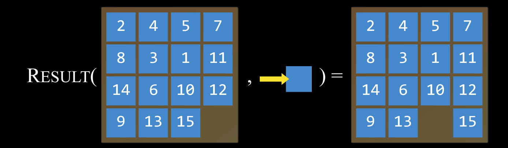

**Agent:** entity that perceives its environment and acts upon that environment.
**State:** the configuration of the agent in its environment, ex: diffrent scrambled states of a rubix cube.
**Actions:** think of it like a function
> Actions(S); where S is a situation.

**Transition Model:** a description of what state results from performing an applicable action to it. Think of it as a function; 
> Results(S, A) which takes in A (action) and S (state) and returns the resulting state.

**State Space:** a diagram that represents all states with arrows showing how to get to where.
**Goal Test:** way to chech if a given state is a goal state.
**Path Cost:** numerical cost. i.e find the optimal solution.

**node:** a data structure that keeps track of:
&nbsp; - a state
&nbsp; - a parent (node that generated this node)
&nbsp; - an action (action applied to parent node to get this node)
&nbsp; - a path cost (from initial state to node)

# Approach/Steps
 - Intialize a variabale called Frontier that contains the intial state
 - Intialize a variable called Explored thta starts empty
 - Repeat:
    - If the frontier is empty, then no solution.
    - Remove a node from the frontier
    - If that node happens to be the goal state, return the solution
    - Add the node to the expolred set
    - Expand node (if next nodes are not in frontier or explored set, then add them to frontier set)

# Uninformed Search - Search strategy that have no context knowlege of the problem
**Stack:** last-in; first-out data type.
**depth-first search:** implements stack, so it always expands to the deepest node in the frontier.
**queue:** first-in; first-out data type.
**breadth-first search:** implements queue, so it always expands to the shallowest node in the frontier.

# Informed Search
**heuristic function h(n):** a function that gives each node a value based of geographic distance from goal (ignoring any barriers).
**greedy best-first search:** algorithm that expands the node that is closest to the goal, by the heuristic function h(n). i.e guessing function
